<picture>
  <source media="(max-width: 600px)" srcset="options/option_3/assets/terminal-hero-mobile.svg">
  
</picture>

[Mission](#01--mission) &nbsp;&middot;&nbsp; [Architecture](#02--delivery-architecture) &nbsp;&middot;&nbsp; [Selected systems](#03--selected-systems) &nbsp;&middot;&nbsp; [Contact](#05--contact)

## 01 / Mission

I translate ambiguous business and operational problems into structured, responsible and usable AI, analytics and automation solutions.

Based in Erlangen, Germany, I bring experience across healthcare technology, applied research, enterprise applications and industrial environments. My focus is not a single model or tool; it is the full path from discovery and evaluation to a system people can understand, govern and adopt.

<picture>
  <source media="(max-width: 600px)" srcset="options/option_3/assets/capability-deck-mobile.svg">
  
</picture>

## 02 / Delivery architecture

<picture>
  <source media="(max-width: 600px)" srcset="options/option_3/assets/system-architecture-mobile.svg">
  
</picture>

The moving signal represents work progressing through five delivery stages. The architecture is generated locally as SVG, remains fully readable without animation, and disables motion when reduced-motion is requested.

**System inputs:** uncertain requirements, operational constraints and available evidence.

**System outputs:** evaluated, reproducible and usable AI or automation workflows.

**Control plane:** Responsible AI, GDPR awareness and human oversight.

## 03 / Selected systems

<picture>
  <source media="(max-width: 600px)" srcset="options/option_3/assets/project-board-mobile.svg">
  
</picture>

<strong>Open the case files</strong>

### Urban Change Detection and Change Captioning

Designed and evaluated AI-assisted pipelines for bi-temporal satellite imagery, covering change detection, change captioning, benchmarking and retrieval-oriented interpretation.

**Technologies:** Python, PyTorch, Computer Vision, Model Benchmarking, Retrieval Patterns

**Status:** Case study in preparation

### Enterprise GenAI and Agentic Automation Exploration

Explored enterprise LLM, RAG, conversational-assistant and agentic workflow use cases through value, feasibility, reliability, governance and human-approval considerations. Described here only at a sanitized capability level; no internal systems, datasets or business details are disclosed.

**Technologies:** Azure OpenAI, Copilot Studio, RAG, Prompt Engineering, Workflow Automation

**Status:** Case study in preparation

### Glottal Area Segmentation Using Deep Learning

Implemented a U-Net-based segmentation workflow in PyTorch using the BAGLS benchmark and reproducible model-evaluation practices.

**Technologies:** Python, PyTorch, U-Net, Computer Vision, Image Segmentation

**Status:** Case study in preparation

### Solar Panel Fault Classification

Fine-tuned a ResNet50 model for solar-panel fault classification and framed the solution as an AI-assisted inspection and predictive-maintenance use case.

**Technologies:** Python, PyTorch, ResNet50, Computer Vision, Transfer Learning

**Status:** Case study in preparation

## 04 / Operating context

| Context | Experience |
|---|---|
| Healthcare technology | **Siemens Healthineers** - Data Analytics and Data Science |
| Applied research | **Fraunhofer IIS** - Software Development, AI, ML and RAG |
| Enterprise delivery | **Cognizant** - Enterprise Applications, Analytics and Automation |
| Education | **M.Sc. Information and Communication Technology**, FAU Erlangen-Nurnberg |

**Languages:** English C1; German B1 progressing toward B2.

**Current focus:** Enterprise RAG, AI agents, workflow automation, MLOps and responsible adoption.

**Status:** Open to full-time Data and AI opportunities.

## 05 / Contact

- [LinkedIn](https://www.linkedin.com/in/sushant-nemade1998/)
- [GitHub repositories](https://github.com/Sushant-Nemade?tab=repositories)

---

Systems Console is generated locally with Python. It uses no remote image service, font, analytics tracker, client-side JavaScript or profile-statistics server. Previous layouts remain available in <a href="README.option-1.md">Option 1</a> and <a href="README.option-2.md">Option 2</a>.