# Hi, I'm Sushant Nemade

**Enterprise GenAI, RAG, Analytics and Automation**

I translate ambiguous business and operational problems into structured, responsible and usable AI, analytics and automation solutions.

Based in Erlangen, Germany, with experience across healthcare technology, applied research, enterprise applications and industrial environments.

## Living Terminal

Generated locally and refreshed automatically; if animations or images don't load, everything you need is also written out as plain text further down this page.

<table>
<tr>
<td width="34%" valign="top">

</td>
<td valign="top">

</td>
</tr>
</table>

*All terminal visuals above are generated locally with Python from `config/profile.json` and `config/theme.json`, and the contribution graph is refreshed automatically through GitHub Actions. No external profile-statistics service, badge service, analytics tracker, remote font, or client-side JavaScript is used.*

## Featured work

Sanitized, conservative descriptions of real work. No unverified metrics, and no fabricated repository links - each project below is marked **Case study in preparation** until a public or sanitized repository is available.

### Urban Change Detection and Change Captioning
Designed and evaluated AI-assisted pipelines for bi-temporal satellite imagery, covering change detection, change captioning, benchmarking and retrieval-oriented interpretation.

**Technologies:** Python, PyTorch, Computer Vision, Model Benchmarking, Retrieval Patterns
**Status:** Case study in preparation

### Enterprise GenAI and Agentic Automation Exploration
Explored enterprise LLM, RAG, conversational-assistant and agentic workflow use cases through value, feasibility, reliability, governance and human-approval considerations. Described here only at a sanitized, capability level - no internal systems, datasets, or business details are disclosed.

**Technologies:** Azure OpenAI, Copilot Studio, RAG, Prompt Engineering, Workflow Automation
**Status:** Case study in preparation

### Glottal Area Segmentation Using Deep Learning
Implemented a U-Net-based segmentation workflow in PyTorch using the BAGLS benchmark and reproducible model-evaluation practices.

**Technologies:** Python, PyTorch, U-Net, Computer Vision, Image Segmentation
**Status:** Case study in preparation

### Solar Panel Fault Classification
Fine-tuned a ResNet50 model for solar-panel fault classification and framed the solution as an AI-assisted inspection and predictive-maintenance use case.

**Technologies:** Python, PyTorch, ResNet50, Computer Vision, Transfer Learning
**Status:** Case study in preparation

## Core capabilities

- **Generative AI:** Azure OpenAI, RAG, embeddings, prompt engineering, Copilot Studio
- **Machine Learning:** PyTorch, scikit-learn, computer vision, deep learning, model evaluation
- **Data and Analytics:** Python, SQL, Power BI, Pandas, Snowflake, data modelling
- **Automation:** Power Apps, Power Automate, workflow design, human-in-the-loop approvals
- **Delivery and Governance:** Git, GitLab, MLflow, CI/CD concepts, Responsible AI, GDPR awareness

## Current focus

- Enterprise RAG and retrieval systems
- AI agents and workflow automation
- Responsible AI and human oversight
- MLOps and reproducible AI workflows
- Data-driven digital transformation

## Experience and education

- **Siemens Healthineers** - Data Analytics and Data Science
- **Fraunhofer IIS** - Software Development, AI, ML and RAG
- **Cognizant** - Enterprise Applications, Analytics and Automation
- **M.Sc. Information and Communication Technology**, Friedrich-Alexander-Universität Erlangen-Nürnberg (FAU)

## Contact

- LinkedIn: [sushant-nemade1998](https://www.linkedin.com/in/sushant-nemade1998/)
- GitHub: [@Sushant-Nemade](https://github.com/Sushant-Nemade)

---

*This README, its "Living Terminal" visuals, and the contribution-graph refresh workflow are generated and validated locally with Python - see [IMPLEMENTATION_STATUS.md](IMPLEMENTATION_STATUS.md) for build details and pending items.*
