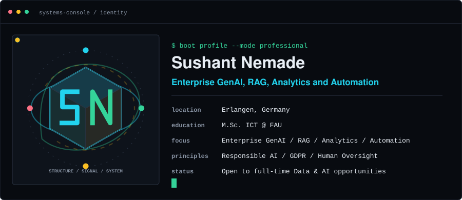
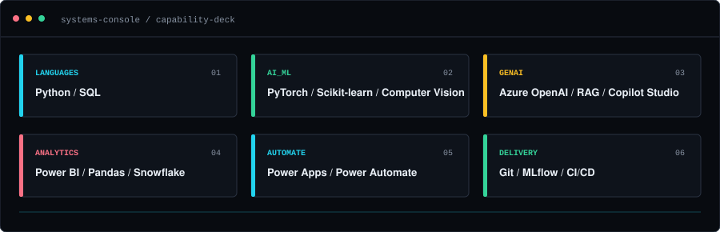
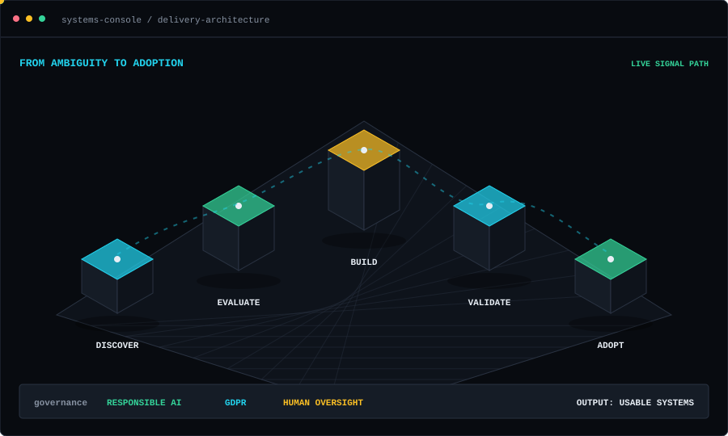
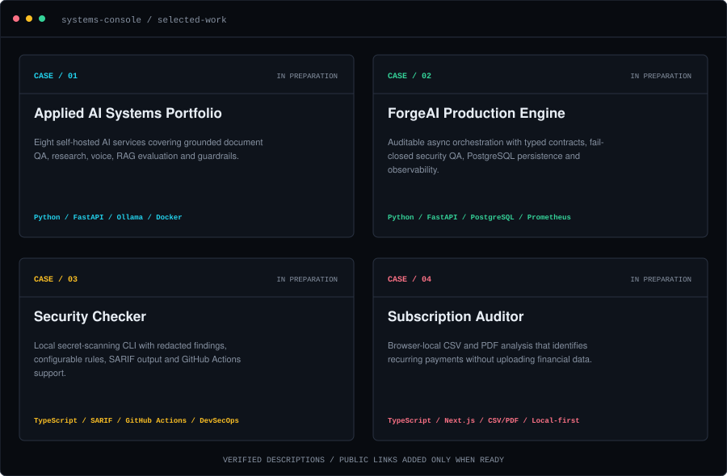

<picture>
  <source media="(max-width: 600px)" srcset="options/option_3/assets/terminal-hero-mobile.svg">
  
</picture>

[Mission](#01--mission) &nbsp;&middot;&nbsp; [Architecture](#02--delivery-architecture) &nbsp;&middot;&nbsp; [Featured systems](#03--featured-engineering-systems) &nbsp;&middot;&nbsp; [Portfolio](#04--portfolio-map) &nbsp;&middot;&nbsp; [Research](#05--research-case-studies) &nbsp;&middot;&nbsp; [Contact](#07--contact)

## 01 / Mission

I translate ambiguous business and operational problems into structured, responsible and usable AI, analytics and automation solutions.

Based in Erlangen, Germany, I bring experience across healthcare technology, applied research, enterprise applications and industrial environments. My focus is not a single model or tool; it is the full path from discovery and evaluation to a system people can understand, govern and adopt.

<picture>
  <source media="(max-width: 600px)" srcset="options/option_3/assets/capability-deck-mobile.svg">
  
</picture>

## 02 / Delivery architecture

<picture>
  <source media="(max-width: 600px)" srcset="options/option_3/assets/system-architecture-mobile.svg">
  
</picture>

The moving signal represents work progressing through five delivery stages. The architecture is generated locally as SVG, remains fully readable without animation, and disables motion when reduced-motion is requested.

**System inputs:** uncertain requirements, operational constraints and available evidence.

**System outputs:** evaluated, reproducible and usable AI or automation workflows.

**Control plane:** Responsible AI, GDPR awareness and human oversight.

## 03 / Featured engineering systems

<picture>
  <source media="(max-width: 600px)" srcset="options/option_3/assets/project-board-mobile.svg">
  
</picture>

### [Applied AI Systems Portfolio](https://github.com/Sushant-Nemade/applied-ai-systems-portfolio)

Eight self-hosted FastAPI workflows for document QA, sentiment analysis, news extraction, PR review, research, voice, RAG evaluation and LLM guardrails. The repository includes local-model defaults, bounded inputs, source provenance, API authentication, tests and CI.

**Stack:** Python, FastAPI, Ollama, Docker | **Status:** Tested reference implementation

### [ForgeAI Production Engine](https://github.com/Sushant-Nemade/forgeai-production-engine)

An auditable control plane that converts constrained product briefs into typed contracts and security-gated execution results. It demonstrates async orchestration, explicit state transitions, PostgreSQL persistence, JWT authentication, migrations, CI and Prometheus/Grafana telemetry.

**Stack:** Python, FastAPI, PostgreSQL, Prometheus | **Status:** Production-oriented architecture

### [Security Checker](https://github.com/Sushant-Nemade/security-checker)

A local secret-scanning CLI and browser tool that redacts detected values, supports configurable rules and exports SARIF for GitHub code scanning. It keeps source content local and documents the boundary between screening signals and confirmed findings.

**Stack:** TypeScript, SARIF, GitHub Actions, DevSecOps | **Status:** Working developer tool

### [Subscription Auditor](https://github.com/Sushant-Nemade/subscription-auditor)

A browser-local application that parses CSV or text-based PDF statements and estimates recurring monthly or annual payments. Financial files remain on the device, and the detector's assumptions and false-positive risks are documented.

**Stack:** TypeScript, Next.js, CSV/PDF processing, local-first design | **Status:** Tested local-first application

## 04 / Portfolio map

The portfolio is grouped by engineering signal rather than chronology. Public previews use fictional data unless a repository explicitly documents configured integrations.

### Production-oriented AI engineering

- [Applied AI Systems Portfolio](https://github.com/Sushant-Nemade/applied-ai-systems-portfolio) - self-hosted AI services with retrieval, evaluation, guardrails and local inference.
- [ForgeAI Production Engine](https://github.com/Sushant-Nemade/forgeai-production-engine) - typed multi-agent orchestration with fail-closed QA, persistence and observability.

### Interactive AI and learning systems

- [AI Werewolf Arena](https://github.com/Sushant-Nemade/ai-werewolf-arena) - multi-agent social deduction with episodic memory, guardrails, decision tracing and an ELO evaluation harness.
- [NeuroDrive](https://github.com/Sushant-Nemade/neurodrive) - browser-based driving simulation with a neural network and genetic algorithm.

### Responsible automation and conversational systems

- [AI Receptionist](https://github.com/Sushant-Nemade/ai-receptionist) - signed Twilio routes, FAQ lookup and Supabase logging; live integrations remain unverified.
- [WhatsApp Business Assistant](https://github.com/Sushant-Nemade/whatsapp-assistant) - verified Meta webhooks and intent routing; the public UI is a simulator, not a live messaging integration.
- [AI Chief of Staff](https://github.com/Sushant-Nemade/ai-chief-of-staff) - Gmail and Calendar briefing prototype; durable Google OAuth is not implemented and scheduled delivery requires configuration.
- [Voice Note Idea Catcher](https://github.com/Sushant-Nemade/voice-note-idea-catcher) - browser recording, optional Whisper transcription and structured action extraction.
- [AI Blog Publisher](https://github.com/Sushant-Nemade/ai-blog-publisher) - attributed BlogBoard derivative with private drafts, digest-bound approval and sanitized static articles; tested reference implementation with live AI/search/R2 integrations unverified.

### Trustworthy data and developer tools

- [Security Checker](https://github.com/Sushant-Nemade/security-checker) - local credential screening with redaction, SARIF output and GitHub Actions support.
- [Subscription Auditor](https://github.com/Sushant-Nemade/subscription-auditor) - private, browser-side recurring-payment analysis for CSV and PDF statements.
- [Money Dashboard](https://github.com/Sushant-Nemade/money-dashboard) - protected income records and integer-cent revenue aggregation with Prisma-backed SQLite; single-admin demo with fictional sample data.

<strong>Open the product prototype lab and portfolio infrastructure</strong>

### Product prototype lab

- [Comment Idea Generator](https://github.com/Sushant-Nemade/comment-idea-generator) - browser-local pasted-comment grouping, content planning and export; no connected social ingestion or model clustering.
- [Creator Collab Matchmaker](https://github.com/Sushant-Nemade/creator-collab-matchmaker) - deterministic ranking using fictional profiles; no account or messaging integration.
- [AI Trip Planner](https://github.com/Sushant-Nemade/ai-trip-planner) - interactive itinerary construction with manually grouped destinations and Maps search links.
- [Public Ship Log](https://github.com/Sushant-Nemade/public-ship-log) - browser-local project timeline and timezone-aware shipping streaks.
- [Custom Link in Bio](https://github.com/Sushant-Nemade/link-in-bio) - locally editable link page with themes, ordering and privacy-conscious click counts.

### Portfolio engineering

- [Interactive Portfolio](https://github.com/Sushant-Nemade/sushant-nemade.github.io) - dependency-free HTML, CSS and JavaScript terminal portfolio with keyboard interaction and responsive layouts.
- [GitHub Profile Systems Console](https://github.com/Sushant-Nemade/Sushant-Nemade) - config-driven SVG profile assets, responsive variants, validation and scheduled automation.
- [AI Project Gallery](https://github.com/Sushant-Nemade/ai-project-gallery) - categorized project catalog with upstream attribution, verification status and a one-project-at-a-time delivery backlog.

### Learning archive

- [DSSS Homework 2](https://github.com/Sushant-Nemade/dsss_homework_2) - earlier Python packaging coursework built around a mathematics quiz.

### Public forks

- [CareerOps](https://github.com/Sushant-Nemade/career-ops) - portfolio fork of [career-ops-hq/career-ops](https://github.com/career-ops-hq/career-ops), a local-first, human-in-the-loop AI job-search agent.
- [AI Job Search](https://github.com/Sushant-Nemade/ai-job-search) - portfolio fork of [MadsLorentzen/ai-job-search](https://github.com/MadsLorentzen/ai-job-search), an AI-assisted job discovery and application workflow.

## 05 / Research case studies

The following work is presented at a sanitized capability level. Public case-study repositories are not yet available, and no internal systems, datasets or business details are disclosed.

<strong>Open the research summaries</strong>

### Urban Change Detection and Change Captioning

Designed and evaluated AI-assisted pipelines for bi-temporal satellite imagery, covering change detection, change captioning, benchmarking and retrieval-oriented interpretation.

**Technologies:** Python, PyTorch, Computer Vision, Model Benchmarking, Retrieval Patterns

**Status:** Case study in preparation

### Enterprise GenAI and Agentic Automation Exploration

Explored enterprise LLM, RAG, conversational-assistant and agentic workflow use cases through value, feasibility, reliability, governance and human-approval considerations.

**Technologies:** Azure OpenAI, Copilot Studio, RAG, Prompt Engineering, Workflow Automation

**Status:** Case study in preparation

### Glottal Area Segmentation Using Deep Learning

Implemented a U-Net-based segmentation workflow in PyTorch using the BAGLS benchmark and reproducible model-evaluation practices.

**Technologies:** Python, PyTorch, U-Net, Computer Vision, Image Segmentation

**Status:** Case study in preparation

### Solar Panel Fault Classification

Fine-tuned a ResNet50 model for solar-panel fault classification and framed the solution as an AI-assisted inspection and predictive-maintenance use case.

**Technologies:** Python, PyTorch, ResNet50, Computer Vision, Transfer Learning

**Status:** Case study in preparation

## 06 / Operating context

| Context | Experience |
|---|---|
| Healthcare technology | **Siemens Healthineers** - Data Analytics and Data Science |
| Applied research | **Fraunhofer IIS** - Software Development, AI, ML and RAG |
| Enterprise delivery | **Cognizant** - Enterprise Applications, Analytics and Automation |
| Education | **M.Sc. Information and Communication Technology**, FAU Erlangen-Nurnberg |

**Languages:** English C1; German B1 progressing toward B2.

**Current focus:** Enterprise RAG, AI agents, workflow automation, MLOps and responsible adoption.

**Status:** Open to full-time Data and AI opportunities.

## 07 / Contact

- [Interactive portfolio](https://sushant-nemade.github.io/)
- [LinkedIn](https://www.linkedin.com/in/sushant-nemade1998/)
- [GitHub repositories](https://github.com/Sushant-Nemade?tab=repositories)

---

Systems Console is generated locally with Python. It uses no remote image service, font, analytics tracker, client-side JavaScript or profile-statistics server. Previous layouts remain available in <a href="README.option-1.md">Option 1</a> and <a href="README.option-2.md">Option 2</a>.
