

<picture>
  <source media="(prefers-color-scheme: dark)" srcset="options/option_2/assets/portrait-dark.svg">
  <source media="(prefers-color-scheme: light)" srcset="options/option_2/assets/portrait-light.svg">
  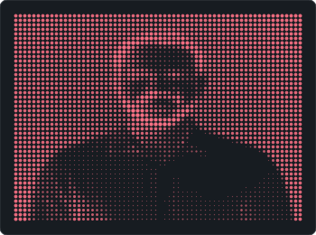
</picture>

<picture>
  <source media="(prefers-color-scheme: dark)" srcset="options/option_2/assets/banner-dark.svg">
  <source media="(prefers-color-scheme: light)" srcset="options/option_2/assets/banner-light.svg">
  
</picture>

[LinkedIn](https://www.linkedin.com/in/sushant-nemade1998/) &nbsp;&middot;&nbsp; [GitHub](https://github.com/Sushant-Nemade) &nbsp;&middot;&nbsp; [Selected work](#04--selected-work) &nbsp;&middot;&nbsp; [Contact](#06--contact)

## 01 / Positioning

I translate ambiguous business and operational problems into structured, responsible and usable AI, analytics and automation solutions.

Based in Erlangen, Germany, my experience spans healthcare technology, applied research, enterprise applications and industrial environments. My current focus is enterprise RAG, AI-assisted workflows, reproducible delivery and human oversight.

<picture>
  <source media="(prefers-color-scheme: dark)" srcset="options/option_2/assets/toolbox-dark.svg">
  <source media="(prefers-color-scheme: light)" srcset="options/option_2/assets/toolbox-light.svg">
  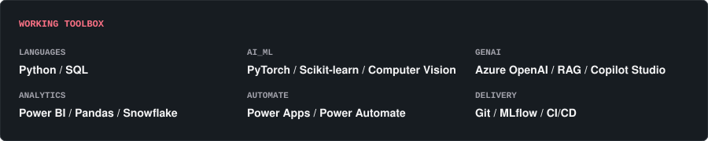
</picture>

## 02 / Evidence map

These views separate declared professional emphasis from observable public-code data. The first chart measures the relative breadth of items in this profile's configured capability groups; it is not a proficiency score. The second reports language bytes from public repositories and does not invent extra axes when the public sample is narrow.

  <picture>
    <source media="(prefers-color-scheme: dark)" srcset="options/option_2/assets/capability-radar-dark.svg">
    <source media="(prefers-color-scheme: light)" srcset="options/option_2/assets/capability-radar-light.svg">
    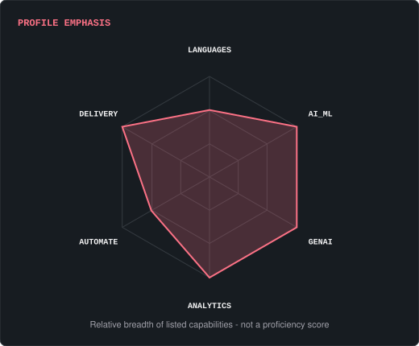
  </picture>

  <picture>
    <source media="(prefers-color-scheme: dark)" srcset="options/option_2/assets/language-signal-dark.svg">
    <source media="(prefers-color-scheme: light)" srcset="options/option_2/assets/language-signal-light.svg">
    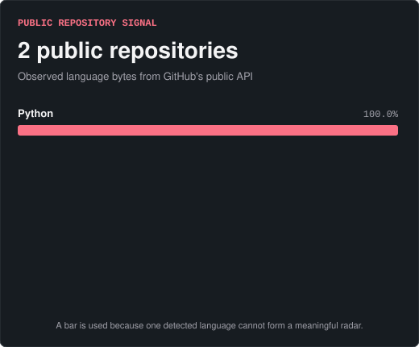
  </picture>

## 03 / Public activity

<picture>
  <source media="(prefers-color-scheme: dark)" srcset="options/option_2/assets/activity-dark.svg">
  <source media="(prefers-color-scheme: light)" srcset="options/option_2/assets/activity-light.svg">
  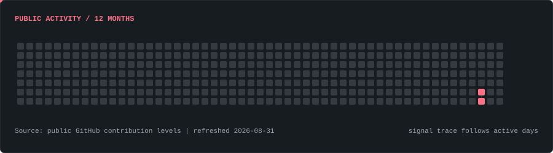
</picture>

<picture>
  <source media="(prefers-color-scheme: dark)" srcset="options/option_2/assets/stats-dark.svg">
  <source media="(prefers-color-scheme: light)" srcset="options/option_2/assets/stats-light.svg">
  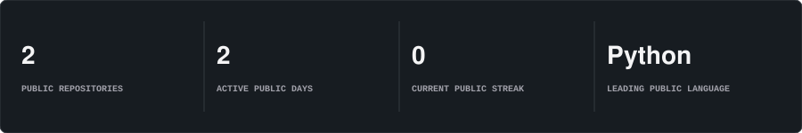
</picture>

The graphics are generated into this repository from public GitHub data. Exact contribution totals are omitted when GitHub's public markup does not expose complete counts.

## 04 / Selected work

Four sanitized case studies show the kinds of problems I have worked on. Repository links will be added only when public or sanitized versions are ready.

  <picture>
    <source media="(prefers-color-scheme: dark)" srcset="options/option_2/assets/project-01-dark.svg">
    <source media="(prefers-color-scheme: light)" srcset="options/option_2/assets/project-01-light.svg">
    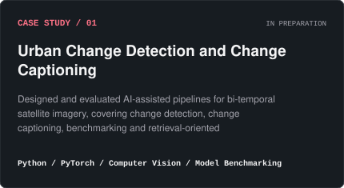
  </picture>

  <picture>
    <source media="(prefers-color-scheme: dark)" srcset="options/option_2/assets/project-02-dark.svg">
    <source media="(prefers-color-scheme: light)" srcset="options/option_2/assets/project-02-light.svg">
    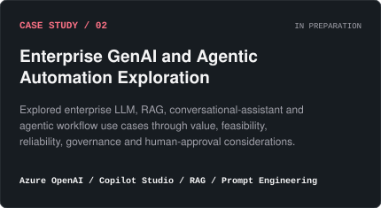
  </picture>

  <picture>
    <source media="(prefers-color-scheme: dark)" srcset="options/option_2/assets/project-03-dark.svg">
    <source media="(prefers-color-scheme: light)" srcset="options/option_2/assets/project-03-light.svg">
    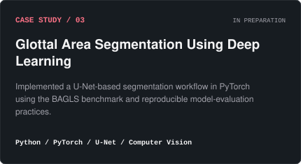
  </picture>

  <picture>
    <source media="(prefers-color-scheme: dark)" srcset="options/option_2/assets/project-04-dark.svg">
    <source media="(prefers-color-scheme: light)" srcset="options/option_2/assets/project-04-light.svg">
    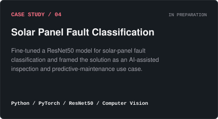
  </picture>

<strong>Read the case-study summaries as text</strong>

### Urban Change Detection and Change Captioning

Designed and evaluated AI-assisted pipelines for bi-temporal satellite imagery, covering change detection, change captioning, benchmarking and retrieval-oriented interpretation.

**Technologies:** Python, PyTorch, Computer Vision, Model Benchmarking, Retrieval Patterns

**Status:** Case study in preparation

### Enterprise GenAI and Agentic Automation Exploration

Explored enterprise LLM, RAG, conversational-assistant and agentic workflow use cases through value, feasibility, reliability, governance and human-approval considerations. Described here only at a sanitized, capability level - no internal systems, datasets, or business details are disclosed.

**Technologies:** Azure OpenAI, Copilot Studio, RAG, Prompt Engineering, Workflow Automation

**Status:** Case study in preparation

### Glottal Area Segmentation Using Deep Learning

Implemented a U-Net-based segmentation workflow in PyTorch using the BAGLS benchmark and reproducible model-evaluation practices.

**Technologies:** Python, PyTorch, U-Net, Computer Vision, Image Segmentation

**Status:** Case study in preparation

### Solar Panel Fault Classification

Fine-tuned a ResNet50 model for solar-panel fault classification and framed the solution as an AI-assisted inspection and predictive-maintenance use case.

**Technologies:** Python, PyTorch, ResNet50, Computer Vision, Transfer Learning

**Status:** Case study in preparation

## 05 / Experience and education

- **Siemens Healthineers** - Data Analytics and Data Science
- **Fraunhofer IIS** - Software Development, AI, ML and RAG
- **Cognizant** - Enterprise Applications, Analytics and Automation
- **M.Sc. Information and Communication Technology**, Friedrich-Alexander-Universitat Erlangen-Nurnberg (FAU)

**Working principles:** Responsible AI, GDPR awareness and human oversight.

**Languages:** English C1; German B1 progressing toward B2.

**Status:** Open to full-time Data and AI opportunities.

## 06 / Contact

- [Connect on LinkedIn](https://www.linkedin.com/in/sushant-nemade1998/)
- [Explore my public GitHub repositories](https://github.com/Sushant-Nemade?tab=repositories)

---

Option 2 is generated locally with Python and stored in this repository. Core visuals use no remote font, analytics tracker, client-side JavaScript, or third-party statistics server. Option 1 remains preserved in <a href="README.option-1.md">README.option-1.md</a>.
